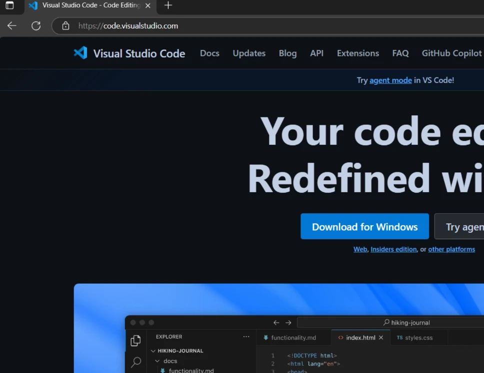
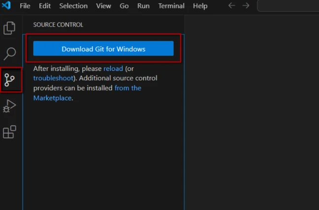
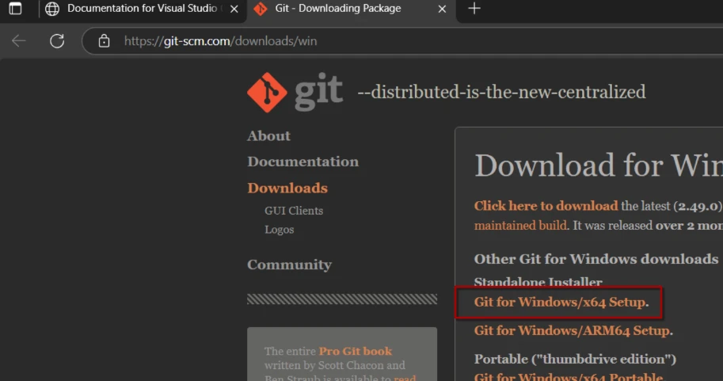
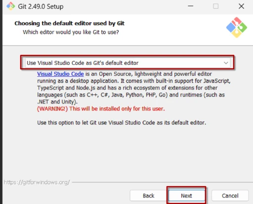
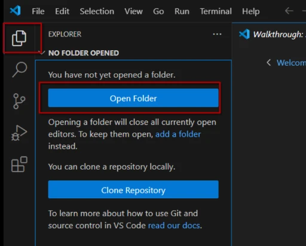
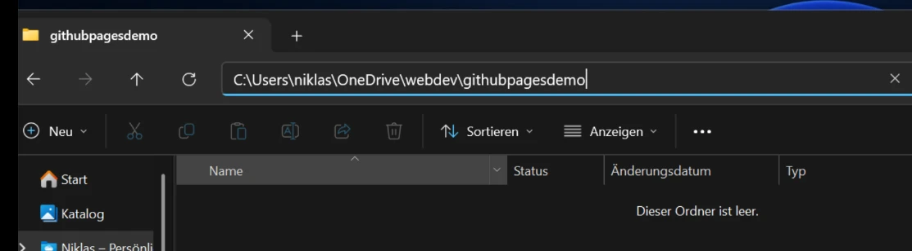

+++
title = 'Github Pages für Laien - Deine kostenlose Website, erstellt wie ein Profi'
slug = 'github-pages'
date = 2025-06-07
lastmod = 2025-06-07
image = 'webdesigner.png'
draft = true
tags = ['Open Source']
summary = 'Dieser Artikel beschreibt, wie GitHub Pages als einfache und effektive Lösung für die Erstellung moderner Websites genutzt werden kann'
+++


Im Artikel https://niklas-stephan.de/blog/perfect-website-2025/ hatte ich beschrieben, dass Wordpress mittlerweile nicht mehr die erste Wahl für die Erstellung moderner Websites ist.
Dort im Vergleich hatte ich aber Profis und Semi-Profis im Auge, die sich gerne mit technischen Details auseinandersetzen, um auch das letzte bisschen an Optimierungspotenzial und Möglichkeiten auszuschöpfen.

Was die Erstellung simpler und doch moderner Websites betrifft, gibt es jedoch auch einfachere Alternativen, die weniger technisches Know-how erfordern. Eine der einfachsten Möglichkeiten, ohne komplett den professionellen Anspruch zu verlieren oder sich auf externe Dienstleister verlassen zu müssen, ist die Nutzung von Plattformen wie GitHub Pages.

Dieser Artikel beschreibt, wie GitHub Pages als einfache und effektive Lösung für die Erstellung moderner Websites von dir genutzt werden kann. Dabei gehe ich auf die benötigten Tools und Schritte ein, um eine Website schnell erfolgreich zu erstellen.

## Szenario

Wir gehen davon aus, dass wir ein Anfänger sind und mit einem Computer mit einem Intel (oder AMD) Prozessor arbeiten auf dem Windows, MacOS oder Linux installiert ist. Unser Ziel ist öffentlich eine von uns erstellte Website unter einer von Github generierten URL wie https://handtrixx.github.com/githubpages bereitzustellen.
Das Ergebnis soll dann so aussehen:

BILD

## Was brauchen wir?

Um die Website zu erstellen, benötigst du folgende Werkzeuge:

1. Einen Texteditor
2. Das Tool GIT
3. Ein GitHub-Account
4. Eine HTML-Datei

Als Texteditor werden wir für unser Mini Projekt "Visual Studio Code" verwenden, da es für fast alle Betriebssysteme verfügbar ist und eine Vielzahl von Erweiterungen, wie z.B. GIT, bietet.

GIT ist ein Versionskontrollsystem, das es dir ermöglicht, Änderungen am Code nachzuverfolgen, kontrollieren und effizient mit anderen zusammenzuarbeiten.
So kannst du lokal auf deinem PC an der Website arbeiten, ohne dass die Änderungen sofort live (für alle sichtbar) geschaltet werden.

Github ist eine Plattform, die es ermöglicht, unseren Code zu speichern, zu versionieren und mit anderen zu teilen. Anders forumliert handelt sich um eine grafische Oberfläche von Git mit einer Menge Extras um deren Betrieb du dich nicht kümmern musst.

Für die Erstellung der HTML Datei werden wir das Bootstrap Framework verwenden, welches uns eine Menge Arbeit beim Design der Seite abnehmen wird.

Nun kann es losgehen!

## Voraussetzungen und erste Schritte

Die folgende Anleitung weicht je nach Betriebssystem und persönlicher Konfiguration leicht ab.

### Installation Visual Studio Code und Git

Das Programm Visual Studio Code kannst du kostenlos von der offiziellen Website unter https://code.visualstudio.com/ heruntergeladen und installiert werden.



Beim ersten Start des Programs begrüßt uns ein Assistent, den wir einfach schließen können, falls wir ihn nicht benötigen.

Dafür navigieren wir aber im linken Bereich auf die dritte Option, die für die Git Integration steht. Dort werden wir darauf hingewiesen, dass wir Git zunächst installieren müssen.



Den darauf folgenden Dialog bestätigen wir, was die Öffnung der Git Downloadpage in unserem Browser zur Folge hat.
Dort laden wir die Installationsdatei herunter und führen sie aus.



Nach dem Download der Installationsdatei starten wir die Installation, indem wir die Datei ausführen. Bei der Auswahl der zu installierenden Komponenten belassen wir die Standardeinstellungen und klicken auf "Weiter".



Bei den restlichen Schritten der Installation folgen wir den vorgeschlagenen Werten und warten bis die Installation abgeschlossen ist.

Damit unser Editor optimal mit Git zusammenarbeitet, beenden wir ihn und starten ihn nach der Installation von Git neu.

Weiter geht's mit dem Einrichten unseres Projekts.

### Einrichtung des Projektverzeichnisses

Wir öffnen Visual Studio Code und erstellen ein neues Projektverzeichnis auf der lokalen Festplatte unseres PCs.



Hierbei ist es egal wo auf der Festplatte du den Ordner anlegst, du musst dir den Ort nur merken können und solltest dort unter keinen Umständen andere Dateien speichern, da wir diesen Ordner gleich mit Github synchronisieren werden.

In unserem Beispiel erstellen wir einen Ordner "webdev" in unseren eigenen Dateien und darin den Unterordner "githubpagesdemo".
So ähnlich sollte das dann aussehen:



```bash
C:\Users\niklas\OneDrive\webdev\githubpagesdemo
``` 
Und genau diesen Ordner öffnest du nun in Visual Studio Code.


## Ab ans Eingemachte


## Warum ist das alles kostenlos? Wo ist der Haken?

Git ist ein von Linus Trovalds (dem "Erfinder des Betriebssystems Linux) mehr oder minder aus Frust über mangelende Alternativen geschriebenes Open Source Versionierungssystem. Open Source bedeutet, dass jeder den Code einsehen, nutzen und verändern kann. Das Geschäftsmodell dahinter besteht aus Beratungsdienstleistungen und Support.

Die Platform Github und die zugehörigen Services gehören mittlerweile der Microsoft Cooperation und ist nur in teilen Open Source. Microsoft bietet die Basisservices kostenlos an, um mit erweiterten Dienstleistungen für den professionellen Einsatz Geld zu machen.

Visual Studio Code ist ebenfalls von Microsoft als Open Source Software entwickelt. Es gilt als leichtgewichtige Alternative zum kostenpflichtigen Visual Studio (ohne Code am Ende).

Das Boostrap Framework stammt von Twitter (heute X), als Nebenprodukt der Entwicklung von Twitter selbst enstanden, und wurde später vom Team als Open Source veröffentlicht. Ähnlich zum Material Design von Google, werden über solche populären Frameworks die Designrichtlinien für moderne Webanwendungen definiert.

Alle genannten haben sich über einen Zeitraum von wenigen bis vielen Jahren zu "Quasistandards" in der Webentwicklung entwickelt und werden von Millionen von Menschen genutzt.

Der Haken dabei ist, dass Open Source zwar kostenlos ist, aber oft technisches Wissen und Eigeninitiative erfordert, um sie effektiv zu nutzen.

## Fazit

Mit ein wenig Geduld und Arbeit kannst du auch als Anfänger beeindruckende Ergebnisse erzielen und deine eigene Website professionell erstellen!

